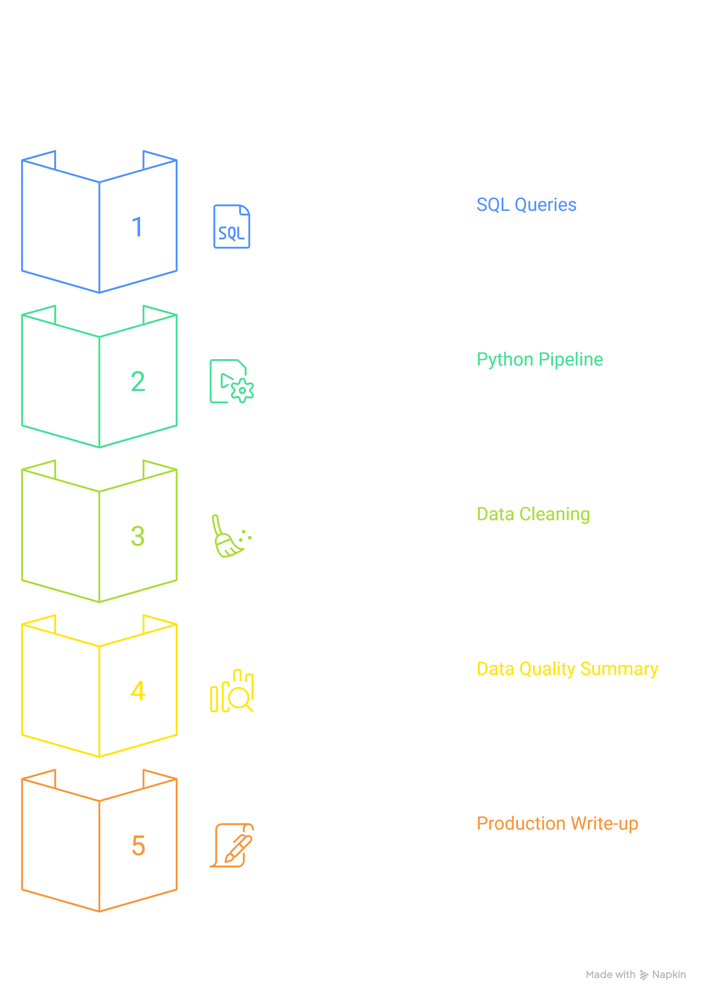

# Flux Full Circle Assessment

**Name & Role:** Rofhiwa - Data Engineer (Junior)

---

## Project Overview

Flux Full Circle consolidates booking data from luxury African lodges and hotels into a central data warehouse. This pipeline takes messy raw booking extracts and turns them into clean, reliable, analysis-ready data.

---

## Project Structure



| Layer | File | What it does |
|---|---|---|
| 1 | `sql/queries.sql` | 5 business SQL queries (revenue, trends, channels, ranking, DQ checks) |
| 2 | `pipeline.py` | Python pipeline: ingest → clean → validate → transform → load |
| 3 | `data/quarantine/bookings_quarantine.csv` | Records that failed cleaning, with rejection reasons |
| 4 | `data/output/data_quality_summary.csv` | Count of every issue type found and how it was resolved |
| 5 | `PART_C_WRITEUP.md` | How to productionise this on GCP + BigQuery |

```
flux_assessment/
├── pipeline.py                   ← Part B: Python pipeline
├── sql/
│   └── queries.sql               ← Part A: all 5 SQL queries
├── PART_C_WRITEUP.md             ← Part C: production write-up
├── README.md                     ← this file
├── project_structure.png         ← visual overview
└── data/
    ├── raw/                      ← source xlsx files (input)
    │   ├── bookings.xlsx
    │   ├── properties.xlsx
    │   └── fx_rates.xlsx
    ├── output/
    │   ├── bookings_clean.csv          ← clean modelled dataset (224 rows)
    │   └── data_quality_summary.csv    ← DQ summary
    └── quarantine/
        └── bookings_quarantine.csv     ← rejected records + rejection_reason (26 rows)
```

---

## How to Run

### 1. Install requirements
```bash
pip install pandas openpyxl duckdb
```

### 2. Run the pipeline
```bash
python pipeline.py
```

The pipeline is fully deterministic and re-runnable. Output files are overwritten on each run. You will see live log output for every stage.

### 3. Run the SQL queries
The SQL queries are in sql/queries.sql. They were written in DuckDB and tested against the clean dataset produced by the pipeline. To run them, load bookings_clean.csv into your preferred SQL environment and execute.


---

## Data Quality Summary

| Issue | Count | Resolution |
|---|---|---|
| Total raw rows ingested | 250 | — |
| Rows in clean dataset | 224 | Kept |
| Rows quarantined (total) | 26 | Quarantined |
| check_out on or before check_in | 11 | Quarantined |
| Stay > 90 nights (implausible) | 8 | Quarantined |
| Duplicate booking_id | 2 | Quarantined (second occurrence) |
| Revenue zero or negative | 1 | Quarantined |
| Revenue missing | 1 | Quarantined |
| num_guests > 30 (implausible) | 1 | Quarantined |
| property_id not in properties | 1 | Quarantined |
| Currency unknown (XYZ) | 1 | Quarantined |

---

## Key Assumptions

- **Date formats**: Two formats mixed in the same column — Excel datetime strings (`"2025-01-13 00:00:00"`) and text (`"16/05/2025"`). Both handled. Rows where neither format works are quarantined.
- **MAX_NIGHTS = 90**: Stays longer than 90 nights treated as data errors (e.g. B1034 was 212 nights).
- **MAX_GUESTS = 30**: 99 guests (B9005) is implausible for a luxury lodge booking.
- **FX rates**: Single static rates applied. In production, rates would be date-versioned.
- **Country standardisation**: P008 listed country as "S. Africa" — corrected to "South Africa".
- **Unknown booking_channel**: Labelled "Unknown" and kept (low-stakes field, not worth quarantining).
- **booking_id uniqueness**: Raw data contained 2 duplicate IDs (B1011, B1021). First occurrence kept, second quarantined.
- **SQL dialect**: DuckDB. Minor syntax changes needed for BigQuery (noted in the SQL file).

---

## AI Tools & Resources Used
Tools and resources used and where they helped:

### AI Assistance
- **Claude (Anthropic) — [claude.ai](https://claude.ai)**
  Used to help structure the pipeline stages, review the validate logic, suggest the currency and channel normalisation maps and review the SQL queries for correctness. All code was read, understood and verified by running it locally before submission. I can explain every line.

- **Napkin AI — [napkin.ai](https://napkin.ai)**
  Used to generate the project structure visual diagram included in this README.

### Documentation & Reference Sites
- **pandas documentation — [pandas.pydata.org](https://pandas.pydata.org/docs/)**
  Used to understand `pd.to_datetime()` for parsing mixed date formats, `pd.to_numeric(errors='coerce')` for safe numeric coercion, and `.map()` for applying normalisation dictionaries.

- **DuckDB documentation — [duckdb.org/docs](https://duckdb.org/docs/)**
  Used to understand how to load CSV files with `read_csv_auto()`, use `DATE_TRUNC()` for monthly grouping, and run window functions like `RANK() OVER (PARTITION BY ...)`.

- **Stack Overflow — [stackoverflow.com](https://stackoverflow.com)**
  Referenced for handling Excel serial date numbers in pandas and for understanding why OneDrive causes `PermissionError` when reading files with Python.

- **Google Cloud / BigQuery documentation — [cloud.google.com/bigquery/docs](https://cloud.google.com/bigquery/docs)**
  Used when writing the Part C production write-up, specifically for understanding partitioning, clustering, Cloud Run jobs and Cloud Scheduler setup.

### YouTube
- **Corey Schafer – Python pandas tutorials**
  *[youtube.com/@coreyms](https://www.youtube.com/@coreyms)*
  Helpful for understanding DataFrame operations, filtering, and applying functions across columns — concepts used heavily in the clean and validate stages.

- **Alex the Analyst – SQL Window Functions**
  *[youtube.com/@AlexTheAnalyst](https://www.youtube.com/@AlexTheAnalyst)*
  Helpful for understanding `RANK()`, `PARTITION BY`, and when to use CTEs — directly applied in SQL Query 4

- **Tech With Tim – Python file handling & project structure**
  *[youtube.com/@TechWithTim](https://www.youtube.com/@TechWithTim)*
  Referenced for structuring a clean Python project with `pathlib.Path` and separating concerns into functions

---

## Part C
See `PART_C_WRITEUP.md` for the full production pipeline write-up covering GCP, BigQuery, monitoring, CI/CD and trade-offs
